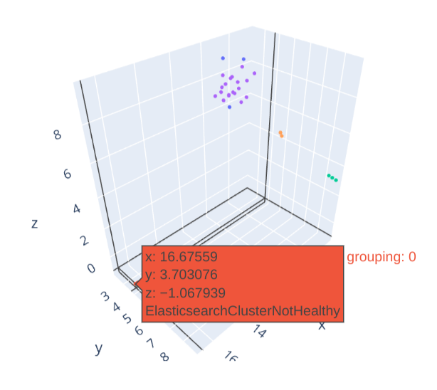

<p align="center">
    
</p>

Obsinthe builds a bridge between observability
(think Prometheus…) and data science and AI/ML (think Pandas or scikit-learn).

It provides:

* client code to connect to observability tools
* additional features for loading data (batches, caching)
* support for conversion into Pandas DataFrames, including different formats: instant vectors, range vectors, intervals…
* visualizations bindings (with Plotly)
* implementation of applied data science for particular observability use cases (e.g. alerts grouping/clustering)
* tools for building synthetic observability data for testing and development purposes

## Quickstart (from repo)

To run code directly from the repository and using provided Jupyter notebooks,
follow the following steps:

1. clone the repository

```sh
git clone git@github.com:obsint/obsinthe.git
cd obsinthe
```

2. install dependencies

We use poetry for in-repo dependency management.

```sh
# we use poetry for in-repo dependency management
pip install poetry

# install dependencies
poetry install --all-extras

```

3. run the demo Jupyter notebook

The features can be tried against live Prometheus, or a synthetic data
can be used in case no Prometheus is available.

``` sh
# open a demo notebook and follow instructions
poetry run jupyter notebook --notebook-dir recipes \
       recipes/prometheus/alerts-clustering-demo.ipynb
```

4. enjoy your drink
<p align="center">
    <br/>
    <em>Alerts intervals timeline.</em>
</p>

</p>
<p align="center">
    <br/>
    <em>Alerts clustering visualization.</em>
</p>

## Quickstart (as a library)

To install `obsinthe` into your existing environment, run the following command
(or corresponding change in your package manager.)

``` sh
pip install obsinthe -E all
```

For quickstart, we recommend installing all dependencies. To avoid installing
unnecessary packages, we try to keep optional dependencies separate (but some
functionality might not be available).

The following python code shows a minimal example of something useful.

``` python
from datetime import datetime, timedelta

import obsinthe.prometheus as prom
from obsinthe.prometheus.data import intervals_concat_days

# Initialize client and loader.
client = prom.Client(url="https://prometheus.example.com",
                     token="my-very-secret-token-shhh")
loader = prom.Loader(client)

# Define START and END of loaded data interval.
END = datetime.utcnow()
START = END - timedelta(days=3)

# Load data from source, one query a day to split the load.
# The returned collection is list-like object with a dataset per day.
alerts_ranges_collection = loader.interval_query("ALERTS[24h:1m]", START, END)
alerts_ranges_collection[0].df
# => Out:
#                          alertname  ...                          values
# 0                       TargetDown  ...  [1710543000.0, 1.0, 1710543...
# 1   KubeDeploymentReplicasMismatch  ...  [1710542940.0, 1.0, 1710543...
# 2                 KubeNodeNotReady  ...  [1710543120.0, 1.0, 1710543...

# Convert each dataset in the collection from range vectors to intervals.
alerts_intervals_collection = alerts_ranges_collection.fmap(
    lambda ds: ds.to_intervals_ds(timedelta(minutes=1))
)
alerts_intervals_collection[0].df
# => Out:
#                          alertname  severity  ...                     start                       end
# 0                       TargetDown   warning  ... 2024-03-15 22:49:00+00:00 2024-03-15 23:15:00+00:00
# 1   KubeDeploymentReplicasMismatch   warning  ... 2024-03-15 22:48:00+00:00 2024-03-15 23:15:00+00:00
# 2                 KubeNodeNotReady  critical  ... 2024-03-15 22:51:00+00:00 2024-03-15 23:18:00+00:00

# Concat the daily intevals and correct them for resolution.
alerts_intervals = intervals_concat_days(
    alerts_intervals_collection
).correct_for_resolution(timedelta(minutes=1))
alerts_intervals.df
# => Out:
#                          alertname  severity  ...                     start                       end
# 0                       TargetDown   warning  ... 2024-03-15 22:50:00+00:00 2024-03-15 23:15:00+00:00
# 1   KubeDeploymentReplicasMismatch   warning  ... 2024-03-15 22:49:00+00:00 2024-03-15 23:15:00+00:00
# 2                 KubeNodeNotReady  critical  ... 2024-03-15 22:52:00+00:00 2024-03-15 23:18:00+00:00
```
